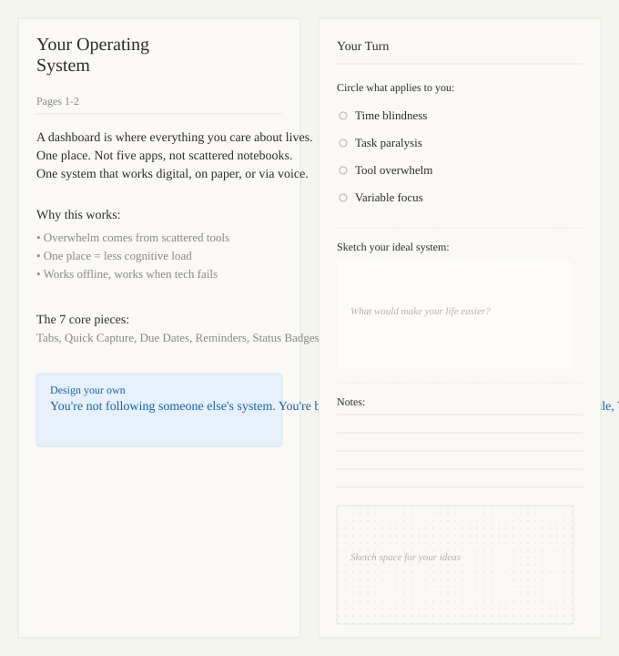
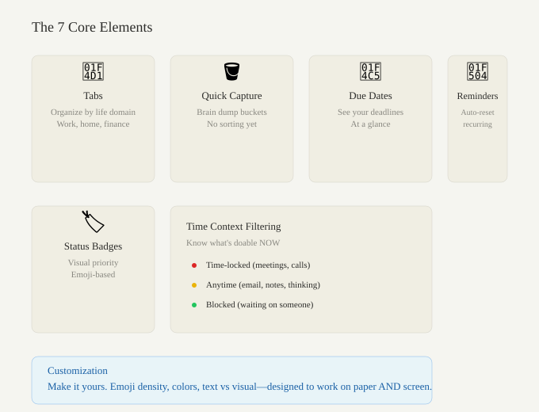

# Help Me Name This (And Tell Me If It's Actually Useful)

From Carrie

Hi sisters,

I'm building something for people like us—people with ADHD brains who lose things, get paralyzed by long task lists, work irregular hours, and need capture methods that work with real life (voice, handwriting, phone, paper, whatever).

It's a hybrid physical + digital system: a working journal where you design your personal operating system once, then use it however you need.

---

## What You're Looking At

This is what the actual workbook pages look like. Left page teaches a concept with examples. Right page has prompts, checkboxes, and space for you to design your version.

---

## The Core Idea

Imagine:

- One place where everything in your life lives (work, home, money, health, goals)
- You design it in a 40-page interactive workbook (you're sketching, writing, personalizing as you read)
- Then you use the same system digitally on your phone/computer
- But if you lose your phone? You still have your system design on paper
- Bad ADHD day and you can't type? You capture via voice or handwriting instead
- Work weird hours (nights, west coast time, variable)? The system adapts to YOUR actual schedule, not 9-5

The philosophy: Stop fighting your brain. Design a system that works WITH how ADHD brains actually work—including the stuff that doesn't change (time blindness, activation energy barriers, paralysis when you see too many tasks).

---

## The 7 Core Pieces

1. **Tabs** — Organize your life into separate areas (Work, Finance, Home, Health, etc.)
2. **Quick Capture buckets** — Dump ideas/tasks/notes anywhere without deciding where they go (typing, voice, handwriting, screenshots—whatever's easiest right now)
3. **Due dates** — See your deadlines at a glance
4. **Recurring reminders** — Things that repeat reset automatically (medication, laundry, paying rent)
5. **Status badges** — Visual emoji/icons so you scan instead of read
6. **Time context filtering** — Know what's actually doable RIGHT NOW (meetings are locked to work hours, emails can happen anytime, some tasks are waiting on other people)
7. **Visual customization** — Make it look like you, not like a productivity app

---

## How It Works: Physical + Digital

The whole thing is hybrid by design. You design it once on paper, then use it however makes sense that day.

**Digital dashboard (your phone/computer):**
- Fast, synced, shows reminders
- Capture via typing or voice
- See your tabs and tasks
- Works wherever

**This workbook (the physical book):**
- Your reference when you forget what goes where
- Backup capture on bad days when you can't focus on a screen
- Survives if you lose your phone
- Space to sketch, doodle, write notes
- Actual place to handwrite things if that's easier

Why this matters: You're not locked into typing. If you want to voice-note your task while driving, it goes in the same system. If you want to handwrite a list on a bad ADHD day, that works too. The system doesn't care how you capture—just that you do.

---

## NOW I NEED YOUR HONEST FEEDBACK

Pick one or two sections below and give me your gut reaction. No sugar-coating.

### 1. NAMING (Pick ONE honest reaction)

Which name resonates with you?

- [ ] **Orbit** — Systems/gravity metaphor, celestial vibe, feels less "productivity app"
- [ ] **Buckets** — Direct, friendly, captures the "brain dump" feeling perfectly
- [ ] **Tabs** — Most literal (it's tab-based), but maybe too technical or tied to web browsers?
- [ ] **Too Many Tabs** — Self-aware joke, very ADHD energy, might be too jokey
- [ ] **LifeOS** — Clear what it is, but reads corporate
- [ ] **Other idea:** ___________________________________

**Which one makes you want to use it? Which one would you tell a friend about?**

---

### 2. HYBRID MODEL — Does This Feel Real?

The whole thing works on paper AND digitally. You can:

- Lose your phone and still remember your system from the workbook
- Capture via voice (Siri), handwriting, typing, screenshots—whatever works that moment
- Use paper notes on a bad ADHD day when you can't focus on a screen

Tell me honestly:

- Would you actually use it this way, or are you digital-only?
- What's your primary capture method? (typing, voice, handwriting, screenshots, something else?)
- When would the paper backup genuinely save you? (What situation?)
- Have you ever discovered a missed deadline after work ended and felt blindsided? When?

**Your answers:**

---

### 3. THE SCHEDULE STUFF

The system adapts to your actual work hours—not 9-5 for everyone.

**How you actually work:**

- Your real schedule (not the official one): ___________________________________
- Do you get blindsided by missed deadlines? When does that happen? ___________________________________
- If you see a work task at 6 PM that was supposed to be done at 5 PM, what happens in your brain? ___________________________________

---

### 4. MAGIC WAND

If you could have any feature in the perfect system for your ADHD brain, what would it be?

**Answer:** ___________________________________

---

### 5. HONEST REACTION

Just pick one:

- [ ] Genius. I want this.
- [ ] Useful but needs X to work for me.
- [ ] Interesting concept but not my thing.
- [ ] Doesn't match how my brain works.

**If you picked "needs X":** What's the X?

___________________________________

---

Thanks for this. Your honesty is gold.
